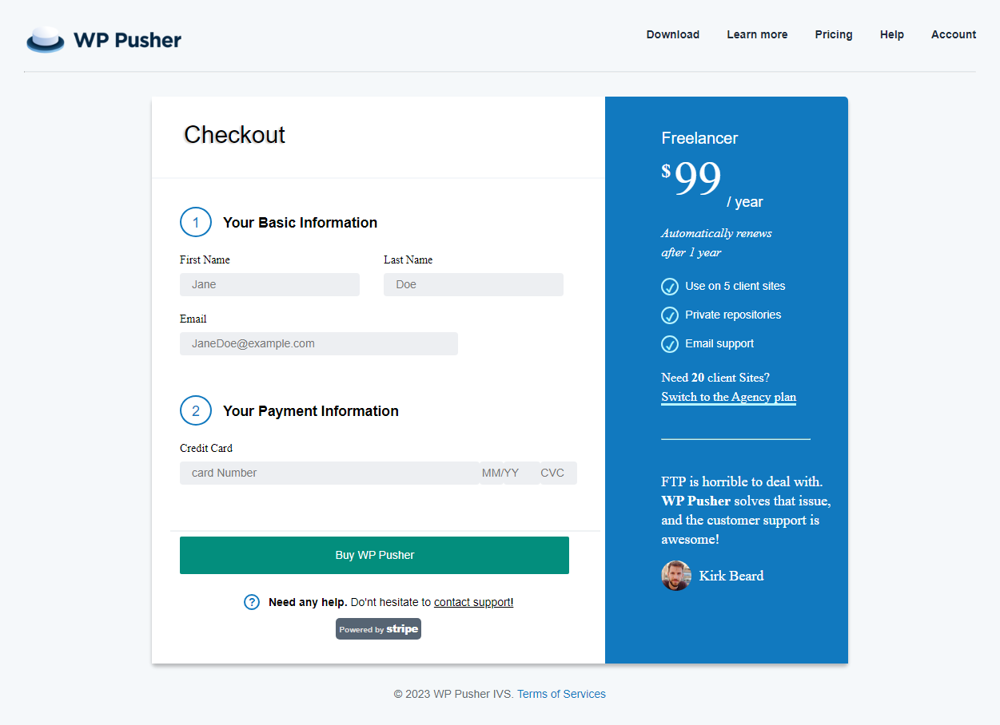
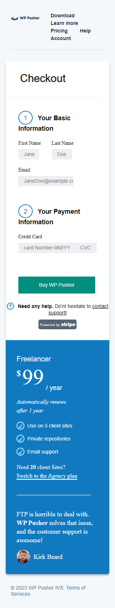

# ALtSchool Africa - Web Development Training

## Table of contents

- [Overview](#overview)
  - [Screenshot](#screenshot)
  - [Links](#links)
  - [Built with](#built-with)
- [Author](#author)
- [Acknowledgments](#acknowledgments)

## Overview

Solve the issues and problems you have with FTPs by using wp pusher.

### Screenshot

### Links

- Live Site URL: [Add live site URL here](https://wp-pusher-smoky.vercel.app/)

### Built with

- **Semantic HTML5**
- **CSS custom**
- **Flexbox**
- **CSS Grid**

## Author

- Github Profile - [@alfarukky](https://github.com/alfarukky)

## Acknowledgments

I express my sincere gratitude to _@altschoolafrica_ and to our mentor _@setemiojo_
